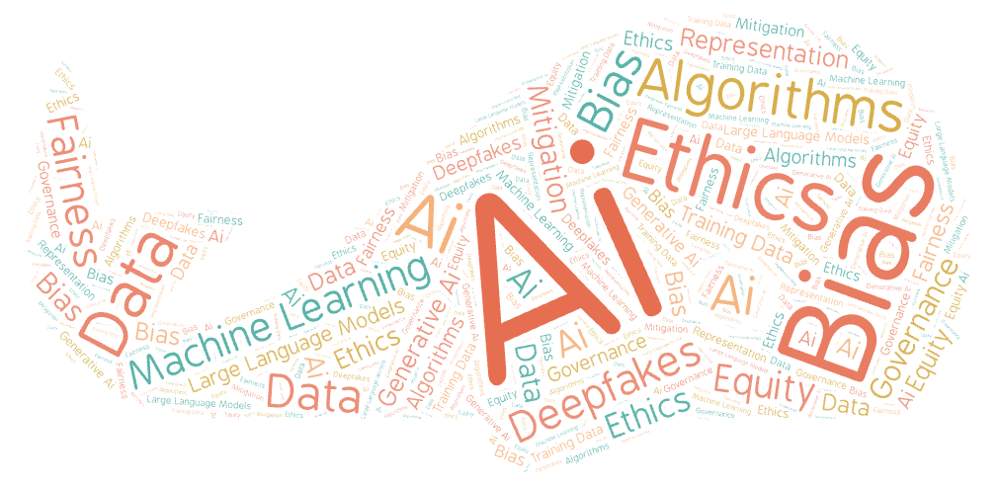
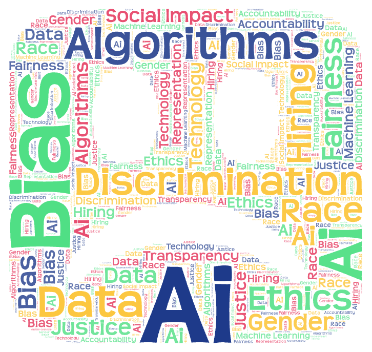

# PaisleyGEOG458lab2

## link to my result spread sheets:
- [Algorithm Bias results](assets/algorithmBias.csv)
- [AI Bias results](assets/aiBias.csv)
- [AI Bias Discrimination results](assets/aiBiasDiscrimination.csv)

## My Topic and Search Parameters
For this assignment, I decided to do the research which examines how people on Youtube discuss things related to algorithm and AI bias, and I would like to the how different search terms would shape the way such this topic is framed. According to the instruction, I successfully san the YouTube crawler bot, and the 3 related seach terms that I used were, "algorithm+bias", "AI+bias", and "AI+bias+discrimination". The reason why I chose these 3 parameters is because I think the first two could be the technical definition for my chosen topic and the last one could be the result of such situation apply on our society.

## Why I want to make this comparison
Even thought these 3 parameters seem similar, and they could probably aim at the same target, but I think these 3 parameters are atucally imply different perspectives and also audience. 
From my perspective, I think parameters like "Alogorithm Bias" could attract those videos which would explain how algorithm work and where the biases are made. And the parameters like "AI bias Discrimination" have more opportunity for the searching bot to find content that focused on inequality and other unfairness issues among the society. By comparing these search results, it could help us to reveal how using different search terms brings up different kinds of videos and perspectives on algorithm bias.

## Comparing amonng my word clouds

[word cloud for Algorithm Bias]

[word cloud for AI Bias]

[word cloud for AI Bias and Discrimination]

Among all 3 word clouds I put above, terms such as "AI", "Bias", "Data" seems appear pretty frequently. I think this is suggesting that people have a common concern on algorithmic system. On the other hand, they also shows difference, which reveals that emphasis changes depending on our search term. For example, the word clouds for Algorithm Bias and AI Bias are highlighting more technial and conceptual language, including things like machin learning, training data, and ethics etc. However, the one for Al Bias and Discrimination are emphasizing on those social terms such as discrimination, race, gender, and justice etc. In my opinion, my word clouds shows that the parameter of AI bias and discrimination is kind of falling between the other 2 parameters, which is combing both technical discussion and human decision-making and justice.

## The possible reasons for this pattern
I believe the possible reason for this pattern could be when people talking about algorithm bias in a more general term, the videos would tend to focus on explainig how algorithms work and where those bias might come from in the original design or dataset. But when the words like "discrimination" are included, the target would slightly changed. Thus the videos we see could possibly paying more attention to the real-world efffects, such as who is harmed under such biases and who should be responsible for such issue. All these things show thaht algorithm bias is not talked about in only one way. The truth is that, the way people discuss algorithm/AI bias would depends a lot on the words poeple used and the concerns those words would brought to our mind.

## The unexpected findings
There's one thing that actually surprised me was that those terms like "ethical" actually appeared less frequently in the word clouds than I expected. Based on my own experience using platforms like YouTube and TikTok, people's discussions of algorithm bias often feel strongly (REALLY) connected to ethics and fairness. However, the results suggest that many videos focus more on explaining how algorithms function or highlighting specific examples, rather than explicitly framing the issue in ethical terms. This made me consider whether this pattern might be influenced by the platform itself, since recommendation systems may favor content that appears more technical or neutral, which could make ethical discussions less visible even if they exist.

